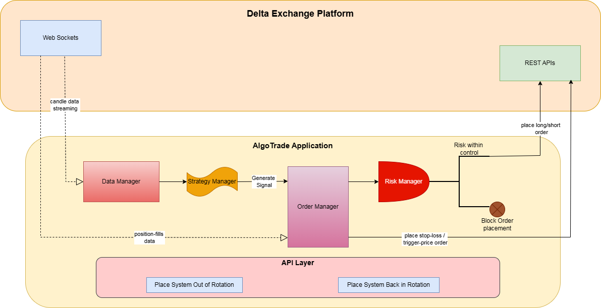

# AlgoTrading

Python algorithmic trading service that connects to **Delta Exchange** (REST + WebSocket), maintains in-memory OHLCV candles with technical indicators, evaluates **per-instrument strategies** on a timed loop, and places live orders along with **risk** and **order** management with YAML-driven configuration.

## High-level Interaction Diagram :

### Major capabilities

| Area | Responsibility |
|------|----------------|
| **Market data** | Bootstrap history via REST, stream candles via WebSocket, upsert into per-symbol/per-timeframe `DataFrame`s |
| **Indicators** | Apply configured indicators (EMA, SMA, RSI, ATR, Supertrend, ADX, NATR, volume SMA) after each candle update |
| **Strategies** | Pluggable modules (`StrategyBase`) loaded from `config.yml` per symbol |
| **Risk** | `RiskManager` gates new entries using recent fill history and per-instrument limits |
| **Execution** | `OrderManager` places IOC limits, bracket logic, cancellations; uses `delta-rest-client` and custom REST where needed |
| **Control plane** | Global **BIR** (back in run) vs **OOR** (out of run): main loop skips trading when not BIR |

## Related files

| Document / path      | Content |
|----------------------|--------|
| `HLD.png`            | Delta REST/WebSocket call flows and order lifecycle |
| `configs/config.yml` | Live configuration template |
| `requirements.txt`   | Python dependencies (Flask, pandas-ta, websocket-client, delta-rest-client, …) |
